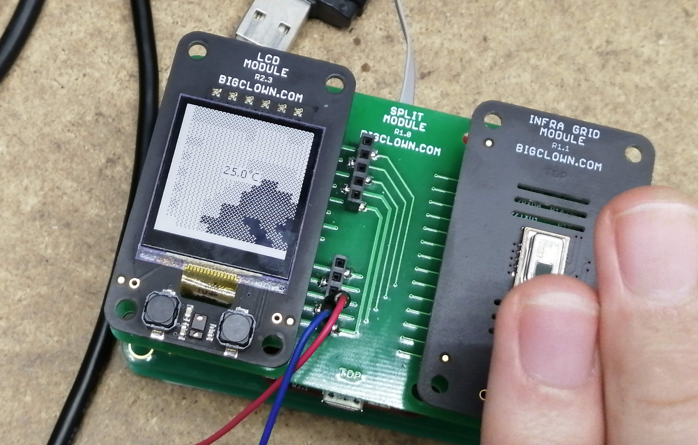

# Infragrid Module mirror for HARDWARIO Core Module

This project is an example that displays thermal data on LCD Module. Press a button to turn on the temperature readout.

Supports both versions of Infragrid Module R1.0 and R1.1.

If you want to get more information about Core Module, firmware and how to work with it, please follow this link:

**https://developers.hardwario.com/firmware/basic-overview/**

User's application code (business logic) goes into `src/application.c`.

## License

This project is licensed under the [MIT License](https://opensource.org/licenses/MIT/) - see the [LICENSE](LICENSE) file for details.

---

Made with &#x2764;&nbsp; by [**HARDWARIO s.r.o.**](https://www.hardwario.com/) in the heart of Europe.
